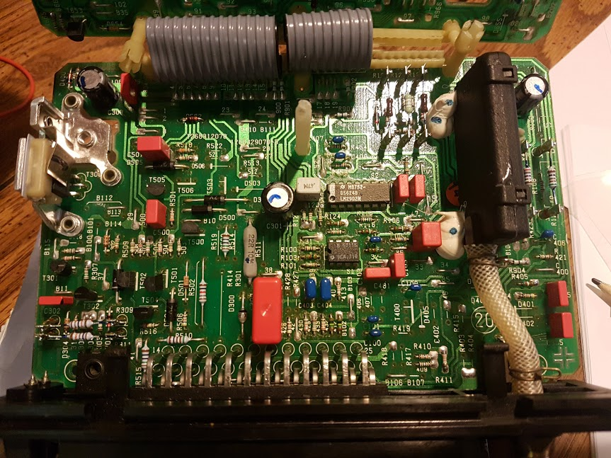
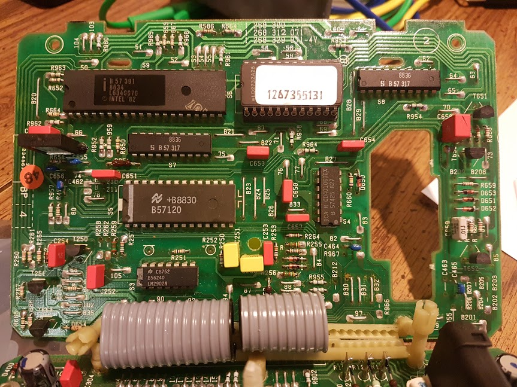

# Porsche 951 KLR Info

## Introduction

### What's This About?
This is the documentation of a little hobby project of mine: to figure out everything about how the Porsche 951 (944 Turbo) knock/boost control computer works. This computer is known is Porsche-speak as the *KLR*, which stands for...something (in German).

The role of the KLR in the 951's engine management is very thorougly explained in the [Technik](reference/TECHNIK491321.pdf) document. That document is a good starting point if you landed here wondering what this is all about. 

The details of the hardware and software have always been a bit of a mystery, though. The DME has been reverse-engineered by various people, and aftermarket re-writes have been on sale for years with lots of improvements over the original. The workings of the original code have been made public too as part of [this](https://sourceforge.net/projects/opendme/) project. But to my knowledge, no one has ever done the same for the KLR, until now. 

### What's a KLR?
Briefly, the KLR is a secondary engine management computer found in the Porsche 944 Turbo. It works alongside the main computer (known as the DME) and provides 2 main functions:

* closed-loop boost control for the tubocharger

* knock (aka detonation) detection and mitigation

All the details that are missing here are in the Porsche Technik document linked in the previous section. 

### What's the Point of This Site?
I've done this purely for the purposes education and critical review - there's no commercial aspect to this project, and it's absolutely *not* a tuning or hacking tutorial. You might find it useful as a starting point for hacking - but be warned: I can't stand over the information I've provided here confidently enough to guarantee that you won't blow something up!

### Prerequisites
To understand this info on this site, you'll need a combination of basic microcontroller programming and electronics knowledge, and a reasonable understanding of how electronic engine management works. But you don't need to be an engineer or a professional programmer. The code we'll be looking at is pretty archaic, and I've had to read a lot of old documentation in order to make sense of it, so I'll try and explain everything as clearly as I can. 

I haven't completely reverse engineered the hardware - for me, it's really all about the code, the *logic*. But you can't understand the code without knowing what the various intput and output pins are hooked up to, so a certain amount of hardware analysis is unavoidable. The only non-trivial part of the hardware is the knock sensor amplifier, which I'll explain in detail. A knowledge of basic, hobbyist-level electronics is all you'll need (that's all I have anyway). 

## Hardware

Here's a pair of images showing the 2 circuit boards of the KLR. It might look like a lot but when you break it down there's not that many components here. At the bottom of the first pic you can see the pins of the 25-way connector - that's where the KLR connects to the engine harness. 

On the right, the big black box with the tube connected to is the pressure sensor, or *MAP* (manifold absolute pressure) sensor - this is how the KLR knows the current boost pressure. 

There are only 2 ICs of interest on this board: the 14-pin device is an LM2902M quad op amp, and the smaller 8-pin is a CA3080 OTA - operational *transconductance* amplifier (used by the knock sensor). This OTA is no longer made but there's a little info available on it on the internet. 

On the second board, from the top left, going right and down,  we have

* the Intel 8048 series microcontroller (the brains of the operation), clocked by an 11Mhz crystal

* the removeable EEPROM with the program and maps

* next there's a couple of address bus latches that we don't need to worry much about (marked "8836"). 

* halfway down on the left we have the 28-pin ADC0809 (an analog-to-digital converter)

* to the right of the ADC is a CD40106 hex Schmitt trigger

* below the ADC is another LM2902M quad op amp, identical to the one from the first board. 

That covers it for integrated circuits! There's a handful of transistors - most of them used for fairly obvious things - and after that, it's pretty much all passive components. 

We'll get into how the various op amps, the OTA, and the ADC are used in great detail later. We won't worry too much about the address latches, because their function is largely invisibe from a logical perspective: they enable communication between the 8048 and the EEPROM, but they're controlled automatically by the 8048. 

For now, in lieu of a proper schematic, here's a very simple block diagram showing which signals go where with respect to the components discussed above:

It's pretty much what you would expect, but there are a few interesting things worth noting:

* there are 2 ADC channels dedicated to the knock sensor:

	* one indicates the general noise level from the knock sensor, and is used to detect a missing/damaged knock sensor, or a noisy engine. These conditions are associated with the blink codes described in the Technik document. 
  
  * the other channel uses a resettable integrator (under the control of the 8048) to integrate the amplifier's output over a window of around 15 degrees of crankshaft rotation; this is the one actually used to detect knock. 

* the KLR has a cool self-diagnostic feature: the 8048 can send a *fake* knock signal to the knock sensor amplifier to test it's condition; if it consistently fails to detect knock from the integrator after doing this test repeatedly, the KLR will throw a blink code to indicate that it's faulty. This is one of the many impressive features of the KLR. 
  
* there are also 2 channels dedicated to the throttle position sensor (TPS). One is the angle, as you'd expect, and the other is the supply voltage. There's always a drop in the voltage supplied to the TPS, and it actually chages as the angle changes (since the amount of current that flows through the wiper into the ADC varies with the wiper angle). The 8048 always calcuales the angle output voltage as a proportion of the supply, so that variations in the supply won't affect the accuracy. 

This diagram is only intended to show the general outline of things; most of the inputs and outputs shown here merely as arrows are actually buffered and/or inverted through the Schmitt triggers, or through discrete transistors. The knock sensor amplifier uses no fewer than 7 op amps! But we'll get into all that eventually. 

## Navigating This Site

I've broken my work down into 2 sections: a walkthrough of most of the key features, with code snippets (currently still work-in-progress), and a reference section with fairly raw information. You could just dive into the disassembled code in the reference section - it's annotated with brief function descriptions, and you can use the pin assignments page for reference. But I'm assuming that most people reading this will benefit from a more gentle introduction, and that's what the walkthrough is for. 

It's written to be read in the order presented below - the code can be pretty complicated in parts, even for simple features, and I need to assume that you have the basics down by the time you start looking at more advanced things like knock detection. 

In the reference section I've provided a few notes on how to read 8048 series code. Most of this information can be found in the official pdfs in the archive section below, but they're pretty long so I wanted to put some of the most important stuff into a more accessible document. If you find anything in the code tough going, it's worth taking a look at my notes. 

## Features

* [Basic KLR signal timing](klr_signal_timing.md) *Here we'll take a look at the most important input and output signals on the scope, and briefly discuss how they're generated, without getting into too much detail.*

* [How the KLR Measures Engine Speed](speed_measurement.md) *Understanding how engine speed is measured is essential if you want to understand how the signals are generated. It's also a soft introdudction to reading the 8048 assembly code.*

* [How the Ignition Signal is Generated](ignition_signal.md) *This section gets into the code in detail and explains exactly how the KLR generates the iginition output signal*

* [RPM Map Axis](rpm_axis.md) *In this section we'll see how the raw engine speed we measured in the timer routine is turned into an rpm range value that can be used as the rpm axis for looking up map values*

* [RPM Constants](rpm_constants.md) *Here we'll look at a large number of small single-axis maps (rpm only) that store lots of important constants*

* [Cycling Valve PWM Generation]() *TBD*

* [Blink Codes]() *TBD*

* [Knock Detection (hardware)](knock_hardware.md) *This section explains the signal conditioning for the knock sensor, and demonstrates how the self-test works*

* [Knock Detection (software)]() *TBD*

* [ADC Reading]() *TBD*

* [Boost Control]() *TBD*

## Reference

* [Pin Assignments](pin_assignments.md)

* [Disassembled, annotated code](Annotated_Stock1987_951KLR.asm)

* [Outline of the code](outline_of_code.md)

* [Reading MCS48 Series Assembly Code](reading_code.md) *Some notes on how to read assembly code for the Intel 8048, aka MCS48 microcontrollers. This should make the rest of the site easier to understand.*

## Other Reference Material (Archived)

* [85 944 Turbo TECHNIK](reference/TECHNIK491321.pdf)
* [DME/KLR Test Plan](reference/DME_KLR_Test_Plan.pdf)
* [MCS48 User's Manual](reference/mcs48.pdf)
* [MCS48 Assembly Language Manual](reference/9800255D_MCS-48_and_UPI-41_Assembly_Language_Reference_Manual_Dec78.pdf)
